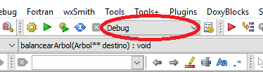
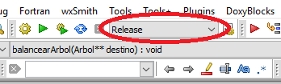


# Ingeniería en Computación

## Algoritmos y Programación 3

### Árboles Binarios de Búsqueda

#### Grupo
  * Monti Matías - matiasmonti@hotmail.com
  * Araneda Alejandro - eloscurodeefeso@gmail.com

Trabajo Práctico entregado el:  
DIA de MES, HORA Hs.  
1ro Cuatrimestre de 2019

#### Docentes:
  * Aciti, Claudio Gustavo
  * Rodríguez, Martín Joel 

## Enunciado

> TP final parte 2: ejercicio integrador
> ---
> Desarrollar un sistema de créditos. Debe permitir:
> - Dar de alta y listar clientes
> - Buscar clientes por nombre
> - Buscar clientes por rango de edad
> - Cada cliente tiene una referencia que puede ser otro cliente
>
> Además cada cliente puede solicitar un crédito con determinado monto:
> - Dar de alta y listar créditos
> - Pagar crédito
> - Cancelar crédito
>
> El sistema debe poder soportar un gran listado de clientes y créditos. Los datos de clientes y créditos deben ser persistentes en archivos. Utilizar estructuras de datos para almacenar los listados. Decidir cuántas unidades se guardan en memoria y si se utiliza ordenamiento de los datos.
>
> Escribir un informe explicando la implementación de cada función y por qué se decidió hacerla de esa forma (un párrafo por cada función, no más). Explicar el modelo de negocio diseñado para resolver el problema (cómo se guardan los datos en los archivos, qué datos se guardan, etc.). Además detallar las dificultades que se enfrentaron en el desarrollo. Por qué se eligió una alternativa frente a la otra.
>
> El diseño del sistema y los modelos es libre. Utilizar la creatividad para que el manejo del sistema sea lo más práctico posible. Si los requerimientos planteados son cumplidos, el ejercicio está aprobado. Puede pasar que en situaciones en la que la cantidad de datos sea muy grande, el sistema sea inmanejable. En ese caso, detallar las limitaciones de la solución propuesta (si las limitaciones son reconocidas no se considera desaprobado el punto). Ideas no-obligatorias de implentar pero que podrían mejorar el sistema: utilizar paginado, poder elegir el cliente de un listado reducido, dar la posibilidad de hacer pagos parciales, generar clientes de prueba y créditos aleatorios de forma masiva, estadísticas de los clientes y créditos, etc.

## Indice General
1. [Introducción](#1-introducción)
2. [Recursos utilizados](#2-recursos-utilizados)
3. [Detalles de implementación](#3-detalles-de-implementación)
   1. [Diagrama de Clases](#3i-diagrama-de-clases)
   2. [Diagramas de Secuencia](#3ii-diagramas-de-secuencia)
      1. [Alta de Cliente](#3iia-alta-de-cliente)
      2. [Buscar Clientes](#3iib-buscar-clientes)
      3. [Listar Clientes](#3iic-listar-clientes)
      4. [Alta de Crédito](#3iid-alta-de-crédito)
      5. [Listar Créditos](#3iie-listar-créditos)
      6. [Operar Crédito](#3iif-operar-crédito)
4. [Conclusiones](#4-conclusiones)

[Referencias](#referencias)

## 1. Introducción

TODO: 
 - [ ] Agregar teoría de índices de archivos (hay un texto clásico que estaba en la bibliografía de Estructura de Datos). 
 - [ ] Si decidimos usar índices de árboles, investigar y agregar teoría de persistencia de árboles.

## 2. Recursos utilizados

TODO: 
 - [ ] Detalles del entorno de programación (IDE, Compilador, plataforma). 
 - [ ] Detalles del standard C utilizado. 
 - [ ] Detalles de las normas de programación seguidas. 
 
 ## 2. Recursos utilizados

Para nuestro desarrollo hemos utilizida el Entorno de Desarrollo Integrado (IDE) Code::Blocks<a name="cita-3" href="#ref-3">[3]</a>
para el sistema operativo Windows y con un compilador portado del GCC de GNU aportado por el proyecto de entorno de desarrollo MinGW<a name="cita-4" href="#ref-4">[4]</a>. 

En cuanto al lenguage C propiamente, hemos utilizado sólo las características y sintaxis del ANSI C89/ ISO C90 adhiriendo en lo posible al estilo de codificación del kernel de Linux<a name="cita-5" href="#ref-5">[5]</a> 
y su guía para la documentación<a name="cita-6" href="#ref-6">[6]</a>. 

## 3. Detalles de implementación

TODO: 
 - [ ] guía para compilar y ejecutar la aplicación. 
 - [ ] Guía para compilar y ejecutar las pruebas.
 - [ ] UML.
 - [ ] por cada archivo "header" detallar los tipos definidos y la interfaz. 
 - [ ] Por cada "source" hacer un resumen de la implementación sólo con detalles relevantes de código.

### 3.i. Diagrama de Clases

### 3.ii. Diagramas de Secuencia

#### 3.ii.a Alta de Cliente 

#### 3.ii.b Buscar Clientes

#### 3.ii.c Listar Clientes

#### 3.ii.d Alta de Crédito

#### 3.ii.e Listar Créditos

#### 3.ii.f Operar Crédito

#### 3.iii. Detalles de implementación

#### Archivo [`aplicacion.c`](aplicacion.c)

El archivo `app.c` contiene la implementación de la aplicación y de las funciones y módulos auxiliares.

#### Archivo [`aplicacion.h`](aplicacion.h)

#### Archivo [`claves.c`](claves.c)

#### Archivo [`claves.h`](claves.h)

#### Archivo [`cliente.c`](cliente.c)

#### Archivo [`cliente.h`](cliente.h)

#### Archivo [`credito.c`](credito.c)

#### Archivo [`credito.h`](credito.h)

#### Archivo [`indice.c`](indice.c)

#### Archivo [`indice.h`](indice.h)

#### AVL

### 3.iv. Guía de Compilación

Para compilar y correr los test en Code::Blocks abrir el proyecto `tp-p1.cbp` y seleccionar en la lista de "build target" la configuración `"Debug"` y presionar <kbd>F9</kbd>:

Para compilar y correr la aplicación en Code::Blocks abrir el proyecto "tp-p1.cbp" y seleccionar en la lista de "build target" la configuración `"Release"` y presionar <kbd>F9</kbd>:

## 4. Conclusiones

TODO:
 - [ ] Crítica de las herramientas utilizadas.
 - [ ] Facilidad/dificultad de conseguir e interpretar teoría.
 - [ ] Conclusiones sobre la fluidez del desarrollo
 - [ ] Conclusiones sobre el alcance y performance de la solución

## Referencias
TODO: 
 - [ ] enlaces de las herramientas, 
 - [ ] referencia bibliográfica de la teoría 
 - [ ] enlaces a las guías de normas de programación.
